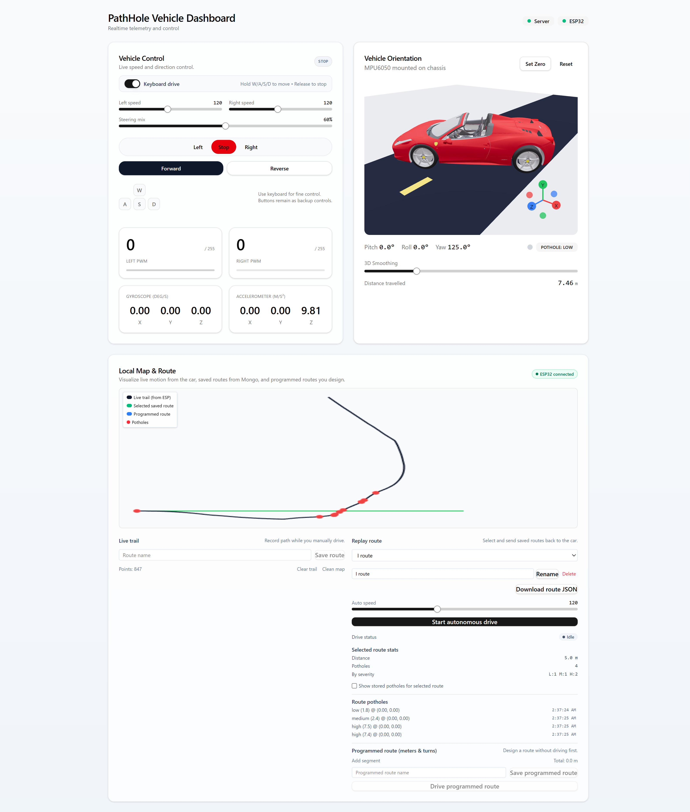
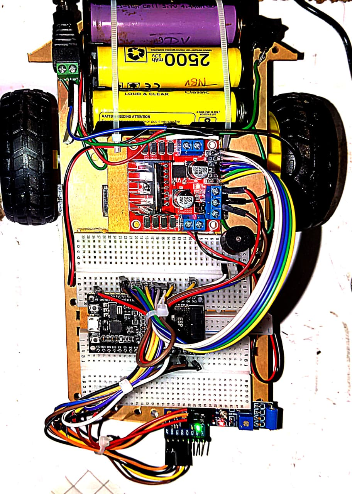

# PathHole – ESP32 Pothole Detection & Autonomous Route Dashboard

PathHole is an end‑to‑end system that turns a small ESP32‑powered vehicle into a **pothole‑sensing, path‑following robot** with a rich **web dashboard**.

The system is made of three main parts:

- **ESP32 firmware**: runs on the car, reads the IMU (MPU6050), estimates pose (position + heading), detects potholes, controls motors, and streams telemetry over WebSockets.
- **Node.js backend**: exposes a WebSocket server for the ESP32 and the React dashboard, validates all messages, persists telemetry and pothole data to MongoDB, and provides REST APIs for saved routes and statistics.
- **React dashboard (Vite)**: visualizes live telemetry, renders a local map, shows pothole events, allows recording and saving routes, and sends autonomous driving commands back to the ESP32.

This README explains all of these in detail: architecture, data models, message formats, hardware/firmware, and how to run and extend the project.

---

## 1. Repository Structure

At the top level, the project is split into the client, server, and ESP32 firmware:

```text
path-hole/
  ESP-32/
    ESP32/           # Blynk-based prototype firmware (pothole detection + manual control)
      ESP32.ino
    ESP32_WS/        # WebSocket-based firmware used by this dashboard/backend
      ESP32_WS.ino

  client/            # React + Vite dashboard
    public/
    src/
      App.jsx
      main.jsx
      hooks/
        useWebSocket.js
      components/
        MapPanel.jsx
        ControlPanel.jsx
        PotholeAlert.jsx
        ConnectionStatus.jsx
        Chassis3D.jsx
        ui/...        # shadcn-like UI primitives (Card, Button, Slider, ...)
    package.json
    vite.config.*

  server/            # Node.js backend (Express + ws + MongoDB)
    models/
      Route.js
      Telemetry.js
      Pothole.js
    server.js
    package.json

  .gitignore
  README.md          # This file
```

---

## Images





---

## 2. High-Level System Architecture

### 2.1 Components

- **ESP32 vehicle**
  - Hardware: ESP32, L298N motor driver, MPU6050 IMU, vibration sensor, active buzzer, wheels.
  - Firmware:
    - `ESP32_WS.ino` – WebSocket‑based, integrates with this server/dashboard.
    - `ESP32.ino` – Blynk‑based, used as an earlier prototype.

- **Backend server** (`server/`)
  - Node.js + Express + ws.
  - MongoDB via Mongoose for persistence.
  - Validates all messages using **Ajv** (JSON Schema).
  - Maintains groups of WebSocket clients: `esp32` and `dashboard`.
  - REST APIs for route CRUD and statistics.

- **React dashboard** (`client/`)
  - React + Vite SPA.
  - Uses custom `useWebSocket` hook to connect to the backend and subscribe to live telemetry, pothole events, route completions, and status.
  - Components:
    - `ControlPanel` – manual driving & maybe other controls.
    - `MapPanel` – local 2D map, route recording, route builder, auto‑drive, stats.
    - `Chassis3D` – real‑time 3D visualization of vehicle orientation.
    - `PotholeAlert` – surface pothole events.
    - `ConnectionStatus` – backend/ESP32 connectivity state.

### 2.2 Data Flow Overview

**Telemetry & pothole detection path:**

1. ESP32 (firmware `ESP32_WS.ino`) reads IMU data every loop and estimates:
   - `posX`, `posY` – local 2D position estimate.
   - `headingDeg` – heading in degrees.
   - `distanceMeters` – integrated distance.
   - Filtered gyro and accel vectors.
2. ESP32 sends WebSocket messages: `{ type: "telemetry", source: "esp32", ts, data: { ... } }` to the backend.
3. Backend validates the message via Ajv (`telemetrySchema`), then:
   - **Broadcasts** telemetry to all dashboard clients.
   - Every ~2 seconds, stores a `Telemetry` document in MongoDB (if `currentRouteId` is set).
4. ESP32 computes **jerk on Z axis** (difference in successive Z acceleration). If jerk exceeds thresholds, it emits a `{ type: "pothole", ... }` event with severity and value.
5. Backend validates the pothole, broadcasts it to dashboards, and stores it as a `Pothole` document (tagged with `currentRouteId`).
6. Dashboard consumes telemetry and pothole events via `useWebSocket` and updates UI:
   - `MapPanel` updates live trail and pothole markers.
   - `Chassis3D` updates vehicle orientation using a complementary filter in `App.jsx`.

**Manual control path:**

1. User interacts with the dashboard `ControlPanel` (e.g., forward/reverse/left/right/stop), which constructs a `motorControl` message:
   - `{ type: "motorControl", source: "ui", data: { direction, speedLeft, speedRight } }`.
2. Dashboard sends this message over the WebSocket using the `send` callback from `useWebSocket`.
3. Backend validates (`motorControlSchema`) and forwards the message to the connected ESP32 client.
4. ESP32 receives the message and calls `setMotor()` to drive the L298N driver pins.
5. A failsafe in the firmware stops motors if commands get stale (`lastCmdMs` gap).

**Route recording & persistence:**

1. When the car is driven manually, each telemetry update triggers `MapPanel` to append a point `{x, y, heading}` to `trail` state.
2. The user can type a **route name** and click **Save route**.
3. `MapPanel` sends `POST /api/routes` to the backend with a payload like:
   ```json
   {
     "name": "Test route",
     "description": "",
     "path": [
       { "x": 0, "y": 0, "heading": 0 },
       { "x": 1.2, "y": 0.5, "heading": 15 },
       ...
     ]
   }
   ```
4. Backend saves a `Route` document in MongoDB and returns it.
5. `MapPanel` updates its `routes` list and selects the newly created route.

**Autonomous drive path:**

1. The user selects a saved route or uses the **Programmed route builder** to generate a path (segments of meters + turns).
2. The user sets auto speed and clicks **Start autonomous drive** (or **Drive programmed route**).
3. `MapPanel` sends an `autoDrive` message over WebSocket:
   ```json
   {
     "type": "autoDrive",
     "source": "ui",
     "ts": 123456789,
     "data": {
       "routeId": "<mongo-id>",
       "speed": 120,
       "path": [ {"x": ..., "y": ..., "heading": ...}, ... ]
     }
   }
   ```
4. Backend validates (`autoDriveSchema`) and forwards it to ESP32, setting `currentRouteId` (for associating telemetry/potholes to the route).
5. ESP32 loads the path into a `route[]` array and sets `autoMode = true`.
6. On each loop iteration, ESP32 calls `autoNavigate()`:
   - Computes vector to current waypoint.
   - If distance < threshold ~0.15m, advance to next waypoint; if at end, stop and emit `routeComplete` event.
   - Otherwise, compute steering error, map to left/right PWM speeds, and command motors.
7. When route is completed, ESP32 sends `{ type: "routeComplete" }`.
8. Backend broadcasts `routeComplete` (including `routeId`), and `MapPanel` records the run in `recentRuns`.

### 2.3 Logical Architecture Diagram (Textual)

```text
+----------------------+           +-------------------------+          +-------------------------+
|   ESP32 Car          |  WS JSON  |   Node.js Backend       |  WS JSON |   React Dashboard       |
|  (ESP32_WS.ino)      +---------->+  (server/server.js)     +--------->+  (client/src)           |
|                      |           |                         |          |                         |
|  - MPU6050 IMU       |           |  - ws WebSocket server  |          |  - useWebSocket hook    |
|  - Motor driver      |<----------+  - message validation   |<---------+  - ControlPanel         |
|  - Pothole detection |  WS JSON  |  - broadcast telemetry  |  WS JSON |  - MapPanel (map/routes)|
|  - autoNavigate()    |           |  - MongoDB (routes,     |          |  - Chassis3D (3D view)  |
+----------------------+           |    telemetry, potholes) |          +-------------------------+
                                   +-------------------------+
```

---

## 3. Backend (server/) – Design & APIs

### 3.1 Technology Stack

- **Node.js** backend.
- **Express** – REST API endpoints.
- **ws** – WebSocket server sharing the same HTTP server.
- **Ajv** – JSON schema validation for all typed WebSocket messages.
- **Mongoose** – MongoDB ODM.
- **dotenv** – load `.env` for configuration.
- **cors** – allow cross‑origin requests from the React client.

### 3.2 Configuration

Environment variables (via `.env` in `server/` or process env):

- **`PORT`** (optional): port for HTTP + WebSocket server.
  - Default: `8080`.
- **`MONGO_URL`**: MongoDB connection string.
  - Default: `mongodb://127.0.0.1:27017/pathhole`.

Example `.env`:

```bash
PORT=8080
MONGO_URL=mongodb://127.0.0.1:27017/pathhole
```

### 3.3 Data Models (Mongoose)

#### Route (`models/Route.js`)

```js
name: { type: String, required: true },
description: { type: String },
path: [
  {
    x: { type: Number, required: true },
    y: { type: Number, required: true },
    heading: { type: Number }
  }
],
createdAt: { type: Date, default: Date.now }
```

Each `Route` is a sequence of waypoints in **local coordinates** (meters), with optional heading at each point.

#### Telemetry (`models/Telemetry.js`)

```js
routeId: { type: mongoose.Schema.Types.ObjectId, ref: "Route" },
posX: Number,
posY: Number,
heading: Number,
speedLeft: Number,
speedRight: Number,
ts: { type: Number, required: true }
```

A **downsampled** snapshot of the car’s state, stored every ~2 seconds during a run when `currentRouteId` is set on the server.

#### Pothole (`models/Pothole.js`)

```js
routeId: { type: mongoose.Schema.Types.ObjectId, ref: "Route" },
posX: Number,
posY: Number,
severity: String,  // "low" | "medium" | "high" | (other -> grouped as "unknown")
value: Number,     // jerk magnitude
ts: { type: Number, required: true }
```

A `Pothole` document represents a single **pothole event** as detected on the ESP32.

### 3.4 REST API Endpoints

Base URL: `http://<server-host>:<PORT>/api` (default `http://localhost:8080/api`).

#### GET `/api/routes`

- **Description**: List recent routes.
- **Response** (200): array of route summaries, sorted by `createdAt` desc.
  - Fields: `_id`, `name`, `description`, `createdAt`.

#### POST `/api/routes`

- **Description**: Create a new route (from live trail or programmed builder).
- **Body** (JSON):
  ```json
  {
    "name": "My test route",        // required
    "description": "optional",      // optional
    "path": [                        // required, non-empty
      { "x": 0, "y": 0, "heading": 0 },
      { "x": 1.2, "y": 0.5, "heading": 10 }
    ]
  }
  ```
- **Errors**:
  - `400 { error: "invalid_route" }` if name missing or path invalid.
  - `500 { error: "failed_to_create_route" }` on server error.

#### GET `/api/routes/:id`

- **Description**: Return a full route including its full `path` array.
- **Responses**:
  - `200` – full route document.
  - `404 { error: "route_not_found" }`.
  - `500 { error: "failed_to_get_route" }`.

#### GET `/api/routes/:id/stats`

- **Description**: Return calculated statistics for a route.
- **Logic**:
  - Distance is computed by summing Euclidean distance between consecutive `path` points.
  - Pothole counts are aggregated from `Pothole` documents for that `routeId`.
- **Response** (200):
  ```json
  {
    "distanceMeters": 12.34,
    "potholesTotal": 5,
    "potholesBySeverity": {
      "low": 3,
      "medium": 1,
      "high": 1,
      "unknown": 0
    }
  }
  ```

#### GET `/api/routes/:id/potholes`

- **Description**: Return all potholes recorded for a route.
- **Response** (200): array of objects with `posX`, `posY`, `severity`, `value`, `ts`.
- **Errors**: `404 route_not_found`, `500 failed_to_get_route_potholes`.

#### PUT `/api/routes/:id`

- **Description**: Update route `name` and/or `description`.
- **Body**:
  ```json
  {
    "name": "New name",         // optional
    "description": "New desc"   // optional
  }
  ```
- **Behavior**:
  - Only non-empty `name` and string `description` are considered.
  - If no valid fields, returns `400 { error: "nothing_to_update" }`.
- **Responses**:
  - `200` – updated route.
  - `404 route_not_found`.
  - `500 failed_to_update_route`.

#### DELETE `/api/routes/:id`

- **Description**: Delete a route by id.
- **Responses**:
  - `204` on success.
  - `404 route_not_found`.
  - `500 failed_to_delete_route`.

### 3.5 WebSocket Protocol (Server side)

All WebSocket messages use a common **envelope** schema:

```json
{
  "type": "telemetry" | "pothole" | "motorControl" | "autoDrive" | "pathCommand" | "hello" | "status" | "ping" | "pong" | "error" | "routeComplete",
  "source": "esp32" | "ui" | "server",
  "ts": 1234567890,
  "data": { ... }
}
```

The server compiles multiple JSON schemas via Ajv:

- `envelopeSchema` – common outer shape.
- `helloSchema` – for client role registration.
- `telemetrySchema` – ESP32 telemetry.
- `motorControlSchema` – UI motor control commands.
- `potholeSchema` – ESP32 pothole events.
- `pathCommandSchema` – generic path commands (not heavily used by current UI).
- `autoDriveSchema` – autonomous drive path + speed.

If an incoming message fails validation, the server replies with an `error` message:

```json
{
  "type": "error",
  "source": "server",
  "ts": 1234567890,
  "data": { "reason": "invalid_..." }
}
```

#### Roles: `esp32` vs `dashboard`

- On connection, each WebSocket client sends `type: "hello"`:
  - ESP32: `{ data: { role: "esp32", deviceId: "esp32-01" } }`.
  - Dashboard: `{ data: { role: "dashboard" } }`.
- Server tracks clients in `groups`: `{ esp32: Set(), dashboard: Set() }`.
- `statusUpdate()` broadcasts `status` events to all dashboards, e.g.:
  ```json
  {
    "type": "status",
    "source": "server",
    "ts": 1234567890,
    "data": { "esp32Connected": true, "reactClients": 1 }
  }
  ```

#### Telemetry messages (from ESP32)

- `type: "telemetry"`, `source: "esp32"`.
- `data` contains:
  ```json
  {
    "speedLeft": 0-255,
    "speedRight": 0-255,
    "distance": 12.345,
    "heading": 90.0,
    "posX": 1.23,
    "posY": 0.45,
    "gyro": { "x": ..., "y": ..., "z": ... },
    "accel": { "x": ..., "y": ..., "z": ... }
  }
  ```

Server actions:

- Broadcasts telemetry to dashboards.
- Every 2 seconds, persists a `Telemetry` document with `routeId = currentRouteId`.

#### Pothole messages (from ESP32)

- `type: "pothole"`, `source: "esp32"`.
- `data` contains:
  ```json
  {
    "severity": "low" | "medium" | "high",
    "value": 1.23,
    "posX": ...,
    "posY": ...
  }
  ```

Server actions:

- Broadcasts pothole to dashboards.
- Persists a `Pothole` document associated with `currentRouteId`.

#### Motor control (from dashboard)

- `type: "motorControl"`, `source: "ui"`.
- `data` contains:
  ```json
  {
    "direction": "forward" | "reverse" | "left" | "right" | "stop",
    "speedLeft": 0-255,
    "speedRight": 0-255
  }
  ```

Server actions:

- Validates message.
- Finds first ESP32 client (if none, returns `esp32_disconnected` error).
- Resets `currentRouteId = null` (manual drive not linked to a route).
- Forwards message to ESP32.

#### Auto drive (from dashboard)

- `type: "autoDrive"`, `source: "ui"`.
- `data` contains:
  ```json
  {
    "routeId": "<mongo id>",   // optional, for linking data
    "speed": 0-255,
    "path": [ {"x": ..., "y": ..., "heading": ...}, ... ]
  }
  ```

Server actions:

- Validates message.
- Forwards to ESP32.
- Sets `currentRouteId` to `data.routeId` (or null if not provided).

#### Route completion (from ESP32)

- `type: "routeComplete"`, `source: "esp32"`, `data` is empty from the ESP32 side.

Server actions:

- Broadcasts `routeComplete` with `data.routeId = currentRouteId`.
- Resets `currentRouteId = null`.


---

## 4. ESP32 Firmware – Pothole Detection & Navigation

There are two firmware sketches under `ESP-32/`.

### 4.1 `ESP32_WS.ino` – WebSocket Integration

This is the firmware that integrates directly with the Node backend and React dashboard.

**Key features:**

- Connects to Wi‑Fi (`WIFI_SSID`, `WIFI_PASS`).
- Maintains a WebSocket connection to the backend (`WS_HOST`, `WS_PORT`, `WS_PATH`, `USE_SSL`).
- Uses `Adafruit_MPU6050` and `Adafruit_Sensor` for IMU readings.
- Estimates:
  - Vehicle speed (`estSpeedMps`).
  - Integrated distance (`distanceMeters`).
  - Heading (`headingDeg`).
  - 2D position (`posX`, `posY`).
- Sends telemetry at ~20 Hz (every ~50 ms).
- Detects potholes via vertical acceleration jerk.
- Supports two modes:
  - Manual control via `motorControl` messages.
  - Autonomous navigation via `autoDrive` / `pathCommand` messages.

**Important sections:**

- Wi‑Fi & WebSocket configuration:
  ```cpp
  const char* WIFI_SSID = "iot";
  const char* WIFI_PASS = "110110110";

  const char* WS_HOST = "10.15.82.112"; // set to your server IP
  const int   WS_PORT = 8080;
  const char* WS_PATH = "/ws";
  const bool  USE_SSL = false;
  ```
  You must change `WS_HOST` to point to your backend machine.

- WebSocket event handler `wsEvent`:
  - On connect, sends `hello` message to register as `esp32`.
  - On `motorControl`, calls `setMotor(...)` and records `lastCmdMs` for failsafe.
  - On `autoDrive` / `pathCommand`, loads waypoints into `route[]` and enables `autoMode`.
  - On `ping`, replies with `pong`.

- IMU calibration & filtering:
  - `calibrateIMU(n)` samples IMU `n` times to compute biases for gyro & accel.
  - Uses low‑pass filters and thresholds to reduce drift and noise.

- `sendTelemetry()`:
  - Reads IMU.
  - Adjusts accel/gyro with biases.
  - Computes estimated speed by blending PWM‑based and accel‑based estimates.
  - Integrates heading and position.
  - Sends `telemetry` JSON via WebSocket.
  - Computes jerk on Z and triggers `pothole` events above thresholds.

- `autoNavigate()`:
  - Computes distance and angle to current waypoint.
  - If close enough, moves to next waypoint.
  - At final point, stops motors, sends `routeComplete` event.

**Failsafe:**

- In `loop()`, if command is stale (`now - lastCmdMs > 300 ms`), motors are stopped.

### 4.2 `ESP32.ino` – Blynk Prototype

This sketch uses **Blynk Cloud** instead of your custom Node WebSocket server.

- Driven by Blynk virtual pins `V0` (forward) and `V4` (reverse).
- Uses MPU6050 Z acceleration and a vibration sensor to detect potholes.
- Sends sensor values to Blynk widgets using `Blynk.virtualWrite(V1, V2, V3)`.
- Not directly integrated with the React dashboard; included as a previous iteration / alternative.

> **Security note:** `ESP32.ino` currently contains hard‑coded `BLYNK_AUTH_TOKEN` and Wi‑Fi credentials. In any public repository, you should remove or replace these with placeholders and use a private `secrets.h` or similar.

---

## 5. React Dashboard (client/) – Frontend Architecture

### 5.1 Technology Stack

- **React** with **Vite**.
- **Custom WebSocket hook** (`useWebSocket.js`).
- **Component library** inspired by shadcn/ui for Cards, Buttons, Sliders.
- Styling via Tailwind‑like utility classes.

The app entry point is `client/src/main.jsx`, which mounts `App` into `#root`.

### 5.2 WebSocket Hook – `useWebSocket.js`

Signature:

```js
const { connected, serverStatus, telemetry, pothole, routeEvent, send } = useWebSocket(url)
```

Behavior:

- **Connects** to WebSocket URL (e.g., `ws://localhost:8080/ws`).
- On open:
  - Marks as `connected`.
  - Sends `hello` message: `{ type: 'hello', source: 'ui', data: { role: 'dashboard' } }`.
- On message:
  - `type === 'telemetry'` → `setTelemetry({ ...msg.data, ts: msg.ts })`.
  - `type === 'status'` → `setServerStatus(msg.data)`.
  - `type === 'pothole'` → `setPothole({ ...msg.data, ts: msg.ts })`.
  - `type === 'routeComplete'` → `setRouteEvent({ ...msg.data, ts: msg.ts })`.
- On close:
  - Marks `connected = false`.
  - Reconnects with **exponential backoff** up to 10 seconds.

The `send(obj)` helper checks `readyState` and serializes the object as JSON.

### 5.3 App Layout – `App.jsx`

Important pieces:

- Reads `wsUrl` from env: `VITE_WS_URL` (defaults to `ws://localhost:8080/ws`).
- Calls `useWebSocket(wsUrl)`.
- Maintains a **complementary filter** for orientation using telemetry’s gyro & accel:
  - Integrates gyro to get yaw/roll/pitch.
  - Uses accel vectors to compute stable roll/pitch.
  - Combines them with `alpha = 0.96`.
- Provides UI controls to:
  - Zero orientation.
  - Adjust 3D `smoothing` for `Chassis3D`.
- Displays:
  - Connection status.
  - 3D chassis with orientation.
  - Distance traveled.
  - Pothole alerts.
  - The `MapPanel` with routing features.

### 5.4 Map & Routes – `MapPanel.jsx`

`MapPanel` orchestrates most of the **route logic** and **visualization**.

Key state variables:

- `trail` – live path from telemetry (list of `{x, y, heading}`).
- `potholes` – live pothole markers from events.
- `routes` – routes fetched from `/api/routes`.
- `selectedRouteId` – active route selection.
- `selectedRoutePath` – full path array from the server for the selected route.
- `routeStats` – stats from `/api/routes/:id/stats`.
- `routePotholes` – stored potholes from `/api/routes/:id/potholes`.
- `useStoredPotholes` – toggles between showing **live** vs **stored** potholes.
- `driveStatus` – `'idle' | 'driving' | 'completed'`.
- `autoSpeed` – PWM value for auto drive.
- `builderSegments` – list of `{ length, turn }` segments for the **programmed route**.
- `builderPath` – generated path points from segments.
- `recentRuns` – last few route completion events.

Key behaviors:

- **Live trail accumulation**:
  - On telemetry updates with numeric `posX`/`posY`, append to `trail`; keep last 2000 points.

- **Live pothole accumulation**:
  - On `pothole` events, append `{x, y}` to `potholes`.

- **Loading routes**:
  - On mount, fetch `/api/routes` and populate `routes`.
  - On `selectedRouteId` change:
    - Fetch `/api/routes/:id` for path.
    - Fetch `/api/routes/:id/stats` for summary stats.
    - Fetch `/api/routes/:id/potholes` for stored potholes.

- **Canvas rendering**:
  - Collects all points from `trail`, `selectedRoutePath`, `builderPath`, and the active set of potholes.
  - Computes bounding box and scales them to fit the canvas with padding.
  - Draws:
    - Live trail (dark line).
    - Selected saved route (green line).
    - Programmed route (blue line).
    - Potholes (red dots).

- **Route saving from live trail**:
  - `handleSaveRoute()` posts `trail` as `path` to `/api/routes`.

- **Export route JSON**:
  - `handleExportRoute()` builds a JSON object containing route metadata, path, and stored potholes and triggers a browser download.

- **Route rename/delete**:
  - `handleRenameRoute()` PUTs to `/api/routes/:id`.
  - `handleDeleteRoute()` DELETEs `/api/routes/:id` and updates `routes`.

- **Autonomous drive**:
  - `handleStartAuto()` sends an `autoDrive` message based on the **selected saved route**.
  - `handleStartBuilderAuto()` sends an `autoDrive` message based on the **builderPath** (programmed route) and optional `selectedRouteId`.

- **Programmed route builder**:
  - User adds segments: each segment is defined by **length (m)** and **turn (degrees)**.
  - A deterministic path generator walks from `(0,0)` with `heading=0`, adding each segment sequentially to build `builderPath`.
  - User can save a programmed route just like a normal route, using `/api/routes`.

- **Recent runs**:
  - On `routeEvent` (from WebSocket), updates `recentRuns` with route name and timestamp.

### 5.5 Other Components

- `ControlPanel` – (not fully documented here, but conceptually): sends `motorControl` messages, may show speed/heading or other controls.
- `PotholeAlert` – surfaces latest pothole event to user.
- `ConnectionStatus` – indicates whether the dashboard is connected to the server and whether the ESP32 is online.
- `Chassis3D` – 3D rendering using the orientation provided by `App.jsx`. It’s fed `pitch`, `roll`, `yaw`, and `smoothing` level.

---

## 6. Running the Project

### 6.1 Prerequisites

- **Node.js** (LTS) and **npm**.
- **MongoDB** (local or remote instance).
- **Arduino IDE** or PlatformIO for ESP32 firmware.
- ESP32 development board + supporting hardware (MPU6050, L298N, motors, etc.).

### 6.2 Start MongoDB

Make sure MongoDB is running and accessible at `MONGO_URL` (e.g. `mongodb://127.0.0.1:27017/pathhole`).

### 6.3 Backend – server/

```bash
cd server
npm install

# create .env (or rely on defaults)
# PORT=8080
# MONGO_URL=mongodb://127.0.0.1:27017/pathhole

npm start
```

This runs `server.js` with `nodemon` on the configured port (default 8080) and prints:

```text
MongoDB connected
WS listening on :8080/ws
```

### 6.4 Frontend – client/

```bash
cd client
npm install

# Optionally configure WebSocket URL (defaults to ws://localhost:8080/ws)
# Create .env.local or .env:
# VITE_WS_URL=ws://<backend-host>:8080/ws

npm run dev
```

Open the displayed Vite dev server URL (e.g. `http://localhost:5173`) in your browser.

### 6.5 ESP32 Firmware – ESP32_WS.ino

1. Open `ESP-32/ESP32_WS/ESP32_WS.ino` in Arduino IDE.
2. Install required libraries (via Library Manager):
   - `WiFi` (bundled with ESP32 core).
   - `WebSocketsClient`.
   - `ArduinoJson`.
   - `Adafruit_MPU6050`.
   - `Adafruit_Sensor`.
3. Configure Wi‑Fi and server:
   - Set `WIFI_SSID` and `WIFI_PASS`.
   - Set `WS_HOST` to the IP or hostname of the machine running the Node server.
   - Leave `WS_PORT` and `WS_PATH` matching the server (`8080` and `/ws` unless changed).
4. Choose your ESP32 board and serial port.
5. Upload the sketch.
6. Open Serial Monitor at 115200 baud to see logs.

Once ESP32 connects, you should see it:

- Connect to Wi‑Fi.
- Connect to WebSocket.
- Send `hello` message.
- Start streaming telemetry.

### 6.6 End-to-End Test

1. Start **server** and **MongoDB**.
2. Start **React client**.
3. Flash **ESP32_WS** firmware and power the car.
4. Confirm in the dashboard:
   - Connection status shows server and ESP32 connected.
   - Live telemetry (orientation, distance) updates.
   - `MapPanel` shows a live trail when you drive.
5. Trigger a pothole (e.g., by a controlled bump) and verify:
   - Pothole alert is shown.
   - Red dot appears on the map.
6. Save the trail as a route and then start an **autonomous drive**.

---

## 7. Extensibility & Future Work

Some ideas and natural extension points:

- **Global coordinates / GPS integration**:
  - Currently `posX`/`posY` are in a **local frame**. You can extend telemetry and routes to include GPS data and plot on real maps (Leaflet/Mapbox).

- **More advanced SLAM / sensor fusion**:
  - Replace the simple velocity integration with a proper EKF or Madgwick filter for better position/orientation estimates.

- **WebSocket authentication**:
  - Right now, any client can connect and send messages if they know the endpoint. You can add JWT‑based authentication or per‑device secrets.

- **Better route planning**:
  - Use algorithms (e.g., A*) in the dashboard or server to generate optimal paths around detected potholes.

- **Historical analytics**:
  - Add pages to visualize heatmaps of pothole density, route comparison, historical statistics, etc., by querying `Telemetry` and `Pothole` collections.

- **Multi‑vehicle support**:
  - Track multiple ESP32 cars with different `deviceId` values and manage them independently in the dashboard.

---

## 8. Summary

PathHole combines **embedded sensing**, **real‑time WebSockets**, and a **web dashboard** to:

- Detect potholes using IMU jerk.
- Live‑stream telemetry from an ESP32 car.
- Visualize paths and potholes on a local map.
- Persist and replay routes from MongoDB.
- Command the car to drive autonomously along saved or programmed routes.

This README walked through the repository layout, backend design and APIs, ESP32 firmware logic, React dashboard architecture, and practical steps to run and extend the system. You can now treat this as the main documentation entry point for the project.
